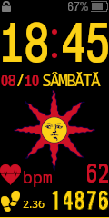
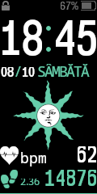

# Personal Xiaomi Mi Band 4 Watchface

   

# Requirements
 - [MiBandWFTool 1.4.2](https://amazfitwatchfaces.com/forum/viewtopic.php?f=29&t=720) _(PaletteImageMode)_
 - [WINE](https://winehq.org) _(for being able to run MiBandWFTool on Linux)_

## Documentation
 - [JSON file format](https://github.com/fm94/MiBand4WF)

# Usage

## Clean-up
To clean up the previous build(s), run the following:
```bash
rm source/watchface/watchface_packed.bin
rm source/watchface/*_animated_*.png
```

## Building
```bash
wine WatchFace.exe source/watchface/watchface.json
```

## Installation
 1. Copy `source/watchface/watchface_packed.bin` to your phone
 at `[UserStorageRoot]/Android/data/com.xiaomi.hm.health/files/watch_skin_local/watchface/watchface.bin`
 2. Open **Zepp Life > Profile > [Your Mi Band 4 device] > Store > Manage tab**
 3. Select the watchface from the list and synchronise it with the band
